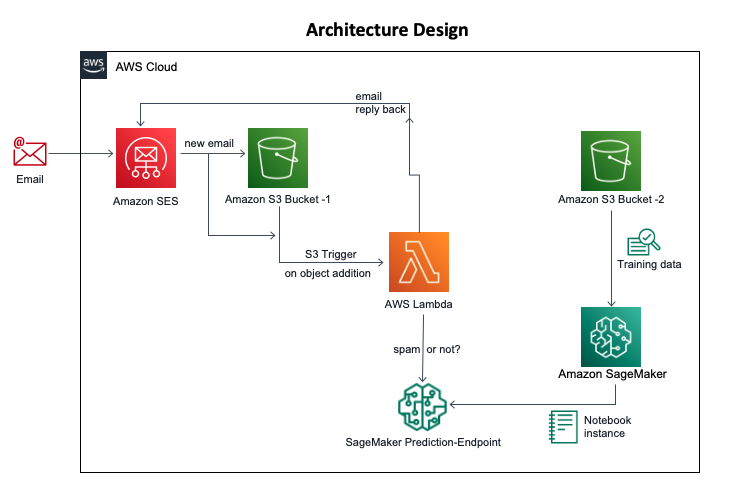
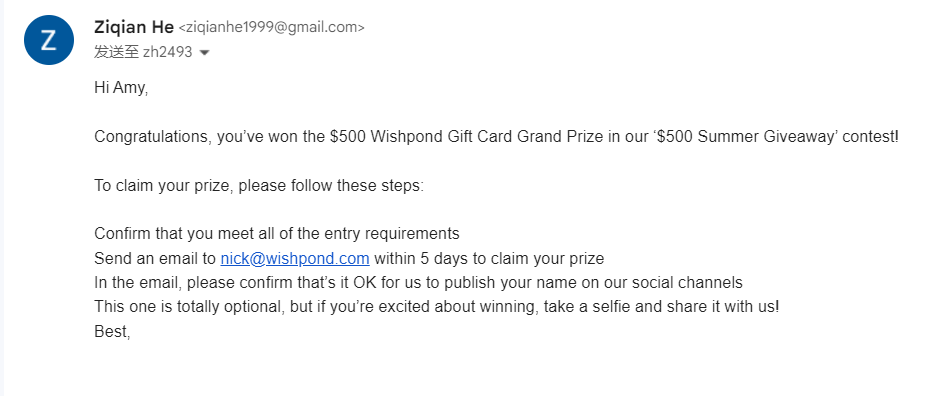
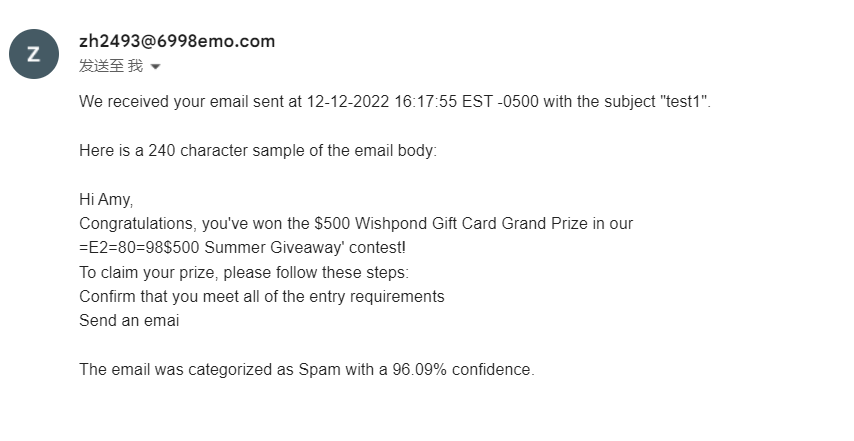
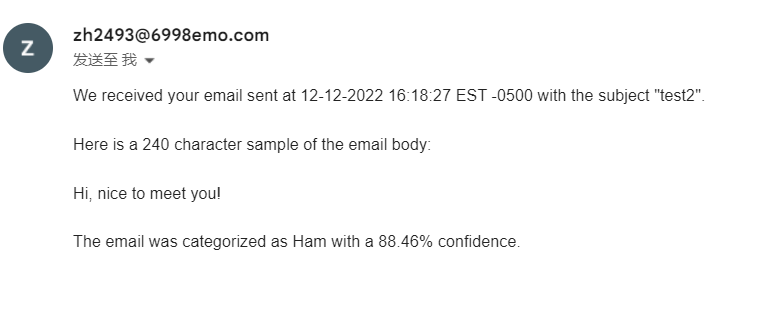

# spamemail
## About
A spam detection system built on AWS cloud, that upon receipt of an email message, automatically flags it as spam or not. This is based on the prediction obtained from the machine learning model created using Amazon SageMaker. The definition and provision of the resources on AWS cloud is done through the AWS Cloudformation template. This template can also be used with AWS code pipeline to automate the resource stack formation.

## Design

## Working 

1.  Send an email to the email address that is used by the spam detector.

2.  Reply that we get, if the email is a spam:

3.  Reply that we get, if the email is NOT a spam:

## Procedure

### Prerequisites:
- AWS cloud subscription ([AWS Free tier](https://aws.amazon.com/free/) works)
- A custom domain 
- An email address for that domain (zh2493@6998emo.com). This will require adding up *MX and TXT records* on the domain provider site to receive an email. Refer the documentation of domain provider to add the records.

### Standing up the AWS resources and Machine Learning spam classifier model using AWS Sagemaker: 
1.  Use the [Cloud Formation template](./CloudFormationStack.json) to create the S3 buckets (for storing emails), AWS sagemaker endpoint, notebook instance, Lambda funtion and appropriate roles. 
2.  Follow the reference link ***Build and train a spam filter machine learning model*** to create, train and deploy the spam classifier model. AWS sagemaker uses [XGBoost ML algorithm](https://docs.aws.amazon.com/sagemaker/latest/dg/xgboost.html) and the [Bank marketing data set](https://archive.ics.uci.edu/ml/datasets/bank+marketing) to build and train the model. You can use your own custom made machine learning model and data set for this purpose. 

### Setting up Simple Email Service (SES) on AWS:
1.  Open SES home on AWS console and navigate to *Domains*. Verify a new domain (prerequisites) that you already own. Copy the 'TXT record' provided on console and add it in your Domain provider's site. 
2.  From the SES home, go to the 'SMTP settings' and copy the 'server name'. Add this as a 'MX record' in your Domain provider's site, just like the 'TXT record' added in the last step. This and previous settings will link the Amazon SES with your custom email address.
3.  Now we need to receive the email that is sent on our custom email address, and store it in the S3 bucket. For this - from the SES home, navigate to the *Email Receiving > Rule Sets > Create Rule*. Use something like the below image to configure the rule set. Use the name of the S3 bucket which was created using the cloud formation template in the previous steps.

### Setting up Lambda function:
We need to setup a Lambda function that gets triggered whenever an email is received on the custom email address.
1. Navigate to the lambda function created as part of the cloud formation template. From there, set up the trigger for the Lambda as your S3 bucket. *Make sure that S3 has required IAM permissions for the Lambda function resource.*
2. For the code part of the Lambda function, use the [Python code](./spam_classify.py). If necessary, add layers in the lambda function for numpy and other libraries. *Make sure that Lambda has required IAM permissions for the S3 resource, SES and CloudWatch.*   
The lambda function is ready to send the email as shown in the ***working section***, back to the sender using the custom email address linked with Amzon Simple Email Service.

## References

- [Amazon SageMaker](https://aws.amazon.com/sagemaker)
- [Machine Learning model using Amazon SageMaker](https://aws.amazon.com/getting-started/hands-on/build-train-deploy-machine-learning-model-sagemaker/)
- [Build and Train a spam filter Machine Learning Model](https://github.com/aws-samples/reinvent2018-srv404-lambda-sagemaker/blob/master/training/README.md)

